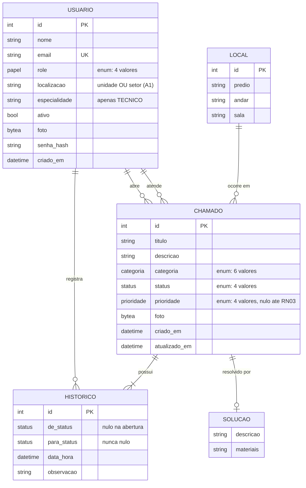

# Modelo de Dados

Sistema de Gestão Predial e Helpdesk.

Este documento descreve o modelo de dados em quatro etapas: o **minimundo** (o
problema em linguagem natural), a **fase conceitual** (o modelo entidade-relacionamento
independente de tecnologia), a **fase lógica** (o modelo relacional) e a **fase
física** (como o modelo é implementado no PostgreSQL).

As fases seguem o modelo de três esquemas: o conceitual descreve *o quê*, o lógico
descreve *como estruturar* e o físico descreve *como o SGBD armazena*.

> **Estado atual.** Hoje a persistência é em memória (`backend/src/dados/store.service.ts`).
> O modelo descrito aqui é o **modelo-alvo** da migração para PostgreSQL, que ainda
> não foi implementada. As seções apontam explicitamente onde o código atual diverge.

---

## 1. Minimundo

Uma administradora de condomínio_predial atende solicitações de manutenção de seus
moradores e de suas áreas comuns.

O fluxo é o seguinte:

1. Um **morador** abre um **chamado** informando o que está com defeito, a **categoria**
   do problema (elétrica, hidráulica, climatização, mobiliário, estrutural ou outros), o
   **local** onde ocorre (prédio, andar e sala) e, opcionalmente, uma foto.
2. O chamado entra na fila com o status **AGUARDANDO_APROVACAO**.
3. Um **gestor** faz a triagem: define a **prioridade** e designa um **técnico** da
   equipe de manutenção. O chamado passa a **REVISADO**.
4. O **técnico** assume o atendimento e o chamado passa a **EM_ANDAMENTO**.
5. Concluído o serviço, o técnico registra a **solução** (o que foi feito e quais
   materiais foram usados) e o chamado passa a **CONCLUIDO**.

**Todo o histórico de movimentações fica registrado.** Cada transição de status gera
um registro de histórico com autor, instante e observação. Esse registro é a
**auditoria** do processo (RF04): responde quem fez o quê, e quando.

**Quatro perfis de usuário** (RBAC):

| Papel | O que faz |
|---|---|
| `SOLICITANTE` | Abre chamados e acompanha o próprio atendimento. |
| `TECNICO` | Executa o atendimento e registra a solução. |
| `GESTOR` | Faz a triagem: define prioridade e designa o técnico. |
| `ADMINISTRADOR` | Administra usuários, define e remove cargos. |

**Restrições de negócio relevantes:**

- **RN01** — Quem solicita é quem abre; o solicitante acompanha apenas os próprios chamados.
- **RN02** — Um chamado nasce sempre `AGUARDANDO_APROVACAO` e sem prioridade atribuída.
- **RN03** — Só o gestor define a prioridade e designa o técnico.
- **RN04** — Para concluir um chamado, a descrição da solução e a lista de materiais são
  obrigatórias e não podem ser vazias.
- **RN05** — O painel exibe o total de chamados por status e o tempo médio de
  resolução.
- **RN06** — A busca de chamados filtra por status, categoria, prioridade, período e
  solicitante.
- **RN07** — Não se pode excluir um usuário que seja autor de chamados.
- **RN08** — Deve existir ao menos um administrador ativo para GERIR a base.

---

## 2. Fase Conceitual — MER

Modelo independente de SGBD, descrevendo entidades, atributos e relacionamentos.

### 2.1 Diagrama



### 2.2 Entidades

| Entidade | Significado |
|---|---|
| `USUÁRIO` | Pessoa com acesso ao sistema, identificada pelo e-mail e_dotada de um papel. |
| `LOCAL` | Ponto físico onde um chamado pode ocorrer: um prédio, e opcionalmente um andar e uma sala. |
| `CHAMADO` | Solicitação de manutenção. É a entidade central do sistema. |
| `HISTÓRICO` | Registro de uma transição de status de um chamado, com autor e instante. |
| `SOLUÇÃO` | Descrição do serviço executado e materiais utilizados. Só existe se o chamado estiver concluído. |

### 2.3 Relacionamentos

| Relacionamento | Cardinalidade | Totalidade | Nota |
|---|---|---|---|
| `USUÁRIO` → `CHAMADO` (solicitante) | 1:N | total | Todo chamado tem exatamente um autor. |
| `USUÁRIO` → `CHAMADO` (técnico) | 1:N | parcial | Um técnico atende N chamados; um chamado pode não ter técnico. |
| `USUÁRIO` → `HISTÓRICO` | 1:N | total | Todo histórico tem exatamente um autor. |
| `LOCAL` → `CHAMADO` | 1:N | total | Todo chamado ocorre em exatamente um local. |
| `CHAMADO` → `HISTÓRICO` | 1:N | total | Todo chamado tem ao menos um histórico: o da abertura. |
| `CHAMADO` → `SOLUÇÃO` | 1:1 | parcial | A solução só existe quando o chamado é concluído. |

Os dois relacionamentos com `CHAMADO` a partir de `USUÁRIO` são **papéis distintos**
(solicitante e técnico), e não o mesmo relacionamento visto duas vezes. É o mesmo
que o diagrama expressa como "`abre`" e "`atende`".

### 2.4 Especialização de `USUÁRIO`

`USUÁRIO` tem quatro papéis, distinguíveis por atributos próprios:

| Papel | Atributo próprio |
|---|---|
| `SOLICITANTE` | `localizacao` (unidade ou bloco onde mora) |
| `TECNICO` | `especialidade` |
| `GESTOR` | `setor` (a área que administra) |
| `ADMINISTRADOR` | `setor` (a área técnica que mantém o sistema) |

Modelada como **um único atributo enumerado** (`papel`) e não como tabela
especializada, porque os papéis não têm atributos próprios Mandatory em todos os
casos e a especialização não é Closed (total). Um novo papel não deve exigir uma
migração de schema.

### 2.5 Anomalias detectadas no modelo atual

O modelo implementado hoje tem cinco desvios do modelo conceitual. Cada um aponta
para um arquivo real.

#### A1 — `unidade` e `setor` são o mesmo atributo, duplicado

`backend/src/auth/auth.service.ts:57-58` faz:

```ts
unidade: dados.unidade.trim(),
setor: dados.unidade.trim(),
```

A mesma atribuição, em dois campos. O seed reforça a confusão: Ana Souza tem
`unidade: 'Bloco A, Ap 204'` e `setor: 'Apartamento 204'` — que descrevem a mesma
coisa com granularity diferente. O frontend também os trata como sinônimos,
exibindo `m.unidade || m.setor || '-'` (`frontend/src/pages/Usuarios.tsx:77`).

Conceitualmente é **um** atributo: a localização da pessoa no prédio. Mantidos
separados, criam a expectativa de dois fatos independentes que nunca divergem,
e a divergência de granularidade fica sem regra que a resolva.

**Correção:** um único atributo `localizacao`. Para o gestor e o administrador o
significado é a área que-responsabiliza-se.

#### A2 — `local` como valor dentro de `chamado` impede agregação

`contrato.ts:69` define `local: Local` como um objeto aninhado, e o seed repete a
tripla `predio`/`andar`/`sala` em cada um dos 5 chamados.

Conceitualmente, o local é uma **entidade**: existe independente do chamado, é
identificado por seus próprios atributos e pode ser compartilhado por vários
chamados. Guardá-lo embutido é anomalia de **repetição**: a mesma informação
(`'Bloco A', '2º andar', '204'`) aparece em duas linhas do seed (chamados 1 e 3
compartilham prédio e andar).

**Consequência prática:** o RN05 exige o ranking de locais com mais chamados. Com
o local embutido, esse ranking só pode ser feito por `GROUP BY` sobre **texto
livre** — e `'Bloco A'` e `'bloco a'` contariam como locais distintos.

**Correção:** entidade `LOCAL`, com referência por chave estrangeira em `CHAMADO`.

#### A3 — `historico` como array depende de ordem de array

`contrato.ts:77` define `historico: Historico[]` como um array dentro do chamado.
Um array é uma estrutura **ordenada por posição**, não por dado. Isso significa que
a ordem correta dos eventos não está garantida pelo próprio dado: depende de a
aplicação escrever na ordem certa.

O modelo conceitual trata o histórico como entidade com identidade própria (cada
movimentação é um fato registrado, com autor e instante). Fatos precisam de chave,
data e ordenação **determinística por dado**.

**Correção:** entidade `HISTÓRICO` com chave estrangeira, ordenada por
`data_hora DESC, id DESC` (o desempate por `id` é o que torna a ordem total).

#### A4 — `foto` é detalhe de transporte, não atributo de domínio

`contrato.ts:71` declara `foto?: string | null`, e o frontend envia a imagem como
string base64 (`data:image/jpeg;base64,...`).

Base64 é um **codificação de transporte**, não uma característica do chamado. Uma
foto é um atributo binário cujo conteúdo não deve ser consultado como texto. Se
guardada como base64, cada consulta que le o chamado carrega o arquivo inteiro na
memória, e a codificação infla o dado em cerca de 33%.

**Correção:** atributo binário (`bytea`) no banco; conversão para base64 na
fronteira da API, que é onde o contrato com o frontend exige string.

#### A5 — O histórico do seed é autocontraditório

`backend/src/dados/seed.ts:96-101`, chamado 1:

```ts
historico: [
  baseHistorico(1, 1, 'CONCLUIDO',    5 * 24),  // conclusão: há 5 dias
  baseHistorico(2, 3, 'EM_ANDAMENTO', 4 * 24, 'REVISADO'),
  baseHistorico(3, 5, 'REVISADO',      4 * 24, 'AGUARDANDO_APROVACAO'),
  baseHistorico(4, 1, 'AGUARDANDO_APROVACAO', 5 * 24),  // abertura: há 5 dias
],
```

O chamado 5 tem `criadoEm` de 5 dias atrás e está `CONCLUIDO`, mas o histórico
declara a conclusão **no mesmo instante da abertura**, e as etapas intermediárias
(`REVISADO`, `EM_ANDAMENTO`) ficam com o status `CONCLUIDO` como destino. Ou seja:
o chamado foi aberto e concluído no mesmo segundo, sem passar por triagem nem
execução — e o array ainda está na ordem inversa da cronológica.

Ordenado por `id` a leitura sai correta por coincidência. Ordenado por `data_hora`
empata e fica indefinido.

**Correção:** no seed, as datas de cada transição devem ser estritamente crescentes
seguindo a ordem de `id`.

---

## 3. Fase Lógica — Modelo Relacional

O MER traduzido para relações. Cada entidade vira uma tabela; cada relacionamento
vira uma chave estrangeira.

### 3.1 Tabelas

```sql
usuarios (
    id               integer      GENERATED ALWAYS AS IDENTITY PRIMARY KEY,
    nome             varchar(120) NOT NULL,
    email            varchar(180) NOT NULL,
    papel            papel        NOT NULL,
    localizacao      varchar(120),
    especialidade    varchar(80),
    ativo            boolean      NOT NULL DEFAULT true,
    foto             bytea,
    senha_hash       varchar(100) NOT NULL,
    criado_em        timestamptz  NOT NULL DEFAULT now(),
    CONSTRAINT usuarios_email_unq UNIQUE (email)
);

locais (
    id               integer      GENERATED ALWAYS AS IDENTITY PRIMARY KEY,
    predio           varchar(80)  NOT NULL,
    andar            varchar(40),
    sala             varchar(60)
);

chamados (
    id                   integer      GENERATED ALWAYS AS IDENTITY PRIMARY KEY,
    titulo               varchar(160) NOT NULL,
    descricao            text         NOT NULL,
    categoria            categoria    NOT NULL,
    status               status       NOT NULL DEFAULT 'AGUARDANDO_APROVACAO',
    prioridade           prioridade,
    local_id             integer      NOT NULL,
    criado_por_id        integer      NOT NULL,
    tecnico_id           integer,
    foto                 bytea,
    solucao_descricao    text,
    solucao_materiais    text,
    criado_em            timestamptz  NOT NULL DEFAULT now(),
    atualizado_em        timestamptz  NOT NULL DEFAULT now()
);

historicos (
    id           integer      GENERATED ALWAYS AS IDENTITY PRIMARY KEY,
    chamado_id   integer      NOT NULL,
    usuario_id   integer      NOT NULL,
    de_status    status,
    para_status  status       NOT NULL,
    data_hora    timestamptz  NOT NULL DEFAULT now(),
    observacao   text
);

tokens_reset (
    token        varchar(128) PRIMARY KEY,
    usuario_id   integer      NOT NULL,
    expira_em    timestamptz  NOT NULL
);
```

### 3.2 Cardinalidades traduzidas

| Cardinalidade | Tradução | Totalidade traduzida |
|---|---|---|
| `USUÁRIO` → `CHAMADO` (solicitante) 1:N | `chamados.criado_por_id` | `NOT NULL` |
| `USUÁRIO` → `CHAMADO` (técnico) 1:N | `chamados.tecnico_id` | admite `NULL` |
| `LOCAL` → `CHAMADO` 1:N | `chamados.local_id` | `NOT NULL` |
| `CHAMADO` → `HISTÓRICO` 1:N | `historicos.chamado_id` | `NOT NULL` |
| `USUÁRIO` → `HISTÓRICO` 1:N | `historicos.usuario_id` | `NOT NULL` |
| `CHAMADO` → `SOLUÇÃO` 1:1 | `chamados.solucao_*` | admite `NULL` |

A **1:1** de solução não vira tabela própria: uma relação 1:1 existe no máximo uma
vez por linha do lado referenciado, então os atributos podem compor a própria
tabela do lado referenciado. Criar `solucoes(chamado_id PK ...)` só acrescentaria
uma junção sem ganho.

### 3.3 Normalização

O modelo está em **3FN**.

**1FN — valores atômicos.** Todos os atributos são escalares. A violação de A2
(`local` como grupo `predio`/`andar`/`sala` dentro do chamado) é resolvida com a
tabela `locais`, que não repete o mesmo local em várias linhas.

**2FN — sem dependência parcial.** Todas as tabelas usam chave primária simples
(surrogate), exceto `tokens_reset`, cuja chave é o próprio token. Não há chave
composta, logo não existe dependência de parte da chave.

**3FN — sem dependência transitiva.** `historicos` guarda `de_status` e
`para_status` como **atributos** de cada transição, e não como referências a uma
tabela de status. É uma decisão deliberada:

> `historicos.de_status` depende da transição, não do chamado. Se `de_status` fosse
> uma referência a `status(status)`, seria dependência transitiva de `chamado_id`.

Guardar o valor é denormalização controlada, e o ganho é real: o histórico é um
**registro imutável de fato**. Se um status fosse renomeado ou adicionado no
futuro, o passado registrado não pode mudar. O histórico é a evidência
auditável do RF04 e deve reflectir o que aconteceu.

O mesmo vale para `historicos.data_hora`: instantâneo do fato, não referência ao
chamado.

### 3.4 Dependências funcionais

```
usuarios.id      → nome, email, papel, localizacao, especialidade,
                   ativo, foto, senha_hash, criado_em
usuarios.email   → id                                    (candidate key)
locais.id        → predio, andar, sala
chamados.id      → titulo, descricao, categoria, status, prioridade,
                   local_id, criado_por_id, tecnico_id, foto,
                   solucao_descricao, solucao_materiais,
                   criado_em, atualizado_em
historicos.id    → chamado_id, usuario_id, de_status, para_status,
                   data_hora, observacao
tokens_reset.token → usuario_id, expira_em
```

Nenhuma chave estrangeira é gerada a partir de outro atributo não-chave: não há
dependência transitiva.

### 3.5 Chaves candidatas

| Tabela | Chave candidata adicional | Motivo |
|---|---|---|
| `usuarios` | `email` | O login é feito por e-mail, então precisa ser única. |
| `locais` | `(predio, andar, sala)` | Um local não pode ser cadastrado duas vezes. Ver ressalva em 4.4. |

---

## 4. Fase Física — PostgreSQL

### 4.1 Domínios enumerados

```sql
CREATE TYPE papel       AS ENUM ('SOLICITANTE', 'TECNICO', 'GESTOR', 'ADMINISTRADOR');
CREATE TYPE status      AS ENUM ('AGUARDANDO_APROVACAO', 'REVISADO', 'EM_ANDAMENTO', 'CONCLUIDO');
CREATE TYPE prioridade  AS ENUM ('BAIXA', 'MEDIA', 'ALTA', 'CRITICA');
CREATE TYPE categoria   AS ENUM ('ELETRICA', 'HIDRAULICA', 'CLIMATIZACAO',
                                 'MOBILIARIO', 'ESTRUTURAL', 'OUTROS');
```

O contrato HTTP (`contrato.ts:4-16`) já restringe esses valores a um conjunto
fechado. O `ENUM` nativo materializa essa restrição no banco: um valor fora do
conjunto é **rejeitado pela coluna**, e não apenas pela aplicação.

### 4.2 Chaves estrangeiras

```sql
ALTER TABLE chamados
    ADD CONSTRAINT chamados_local_fk
        FOREIGN KEY (local_id) REFERENCES locais (id) ON DELETE RESTRICT,
    ADD CONSTRAINT chamados_criado_por_fk
        FOREIGN KEY (criado_por_id) REFERENCES usuarios (id) ON DELETE RESTRICT,
    ADD CONSTRAINT chamados_tecnico_fk
        FOREIGN KEY (tecnico_id) REFERENCES usuarios (id) ON DELETE SET NULL;

ALTER TABLE historicos
    ADD CONSTRAINT historicos_chamado_fk
        FOREIGN KEY (chamado_id) REFERENCES chamados (id) ON DELETE CASCADE,
    ADD CONSTRAINT historicos_usuario_fk
        FOREIGN KEY (usuario_id) REFERENCES usuarios (id) ON DELETE RESTRICT;

ALTER TABLE tokens_reset
    ADD CONSTRAINT tokens_reset_usuario_fk
        FOREIGN KEY (usuario_id) REFERENCES usuarios (id) ON DELETE CASCADE;
```

As regras de `ON DELETE` não são arbitrárias — cada uma decorre de uma
restrição de negócio:

- **`criado_por_id` com `RESTRICT`** — RN07: não se exclui usuário que seja autor de
  chamados. `RESTRICT` (e não `NO ACTION`) porque verifica **imediatamente**, sem
  esperar o fim da transação.
- **`tecnico_id` com `SET NULL`** — o técnico é relevante, mas o chamado é um
  registro histórico que não pode ser apagado. Perder o técnico é aceitável;
  perder o chamado não é. O mesmo vale para `historicos.chamado_id` em `CASCADE`:
  o histórico pertence ao chamado, então se o chamado vai embora, o histórico vai
  junto.
- **`historicos.usuario_id` com `RESTRICT`** — coerente com RN07: o histórico não
  pode ficar órfão de autor.

### 4.3 Restrições de verificação (CHECK)

O RN04 é garantido no banco, não apenas na aplicação:

```sql
ALTER TABLE chamados
    ADD CONSTRAINT chamados_conclusao_incompleta_chk
        CHECK (
            status <> 'CONCLUIDO'
            OR (
                btrim(solucao_descricao) <> ''
                AND btrim(solucao_materiais) <> ''
            )
        );
```

`btrim(...) <> ''` e não `IS NOT NULL`, porque o problema não é só o campo vazio:
é o campo ausente **ou** composto apenas de espaços.

Isso **impede** uma inconsistência que hoje é possível: um chamado `CONCLUIDO` sem
solução registrada. Ver `store.service.ts`, onde a solução é gravada num `Map`
independente do chamado — nada obriga os dois a concordarem.

### 4.4 Índices

```sql
-- Filtros do RN06
CREATE INDEX chamados_status_idx       ON chamados (status);
CREATE INDEX chamados_categoria_idx    ON chamados (categoria);
CREATE INDEX chamados_prioridade_idx   ON chamados (prioridade);
CREATE INDEX chamados_local_idx        ON chamados (local_id);
CREATE INDEX chamados_criado_por_idx   ON chamados (criado_por_id);
CREATE INDEX chamados_tecnico_idx      ON chamados (tecnico_id);
CREATE INDEX chamados_criado_em_idx    ON chamados (criado_em DESC);

-- Ordenação e rastreabilidade do RF04
CREATE INDEX historicos_chamado_data_idx ON historicos (chamado_id, data_hora DESC, id DESC);
CREATE INDEX tokens_reset_expira_idx     ON tokens_reset (expira_em);
CREATE INDEX usuarios_ativo_idx          ON usuarios (ativo);
```

O índice composto de `historicos` atende à ordenação do A3 com uma única
estrutura: `data_hora DESC, id DESC` produz ordem **total** mesmo quando vários
eventos compartilham o mesmo instante — exatamente a ambiguidade do A5.

Sobre a chave candidata `(predio, andar, sala)`: **não** foi criada como
`UNIQUE`. Com `andar` e `sala` opcionais, duas linhas podem ter `sala` nula, e em
SQL dois `NULL` não são iguais entre si, o que faria a restrição falhar em silêncio.
A desambiguação de local fica a cargo da aplicação até haver regra de negócio que
defina o que distingue dois locais de mesmo prédio e sem sala.

### 4.5 Timestamps

Todas as colunas de data/hora são `timestamptz`, nunca `text`.

Hoje `contrato.ts` as declara como `string` ISO, e o seed as produz com
`new Date(...).toISOString()` (`seed.ts:77`). Texto ISO ordena cronologicamente
**apenas** se todos os registros tiverem o mesmo formato e o mesmo fuso — o que não
está garantido. `timestamptz` normaliza para UTC e ordena corretamente por
comparação nativa.

### 4.6 Carga inicial (seed)

A carga usa `IDENTITY`, então as sequências precisam ser advanceadas ao final para
que a próxima inserção não colida com os ids do seed:

```sql
SELECT setval(pg_get_serial_sequence('usuarios', 'id'),
              (SELECT MAX(id) FROM usuarios));
```

O mesmo para `locais`, `chamados` e `historicos`. Sem isso, o primeiro usuário
criado pela aplicação tentaria `id = 1` e receberia violação de unicidade.

---

## 5. Correspondência com o código atual

| Elemento do modelo | Onde está hoje | Situação |
|---|---|---|
| `usuarios` | `store.service.ts` (`Map`), `seed.ts:35-58` | Em memória |
| `locais` | Objeto aninhado em `Chamado`, `contrato.ts:69` | **Não existe** (A2) |
| `chamados` | `store.service.ts` (`Map`), `seed.ts:82-174` | Em memória |
| `historicos` | Array dentro de `Chamado`, `contrato.ts:77` | **Não existe** (A3) |
| `solucao` | `Map` separado, `store.service.ts` | Em memória |
| `tokens_reset` | `Map`, `store.service.ts` | Em memória |
| `foto` | `string` base64, `contrato.ts:71` | Texto (A4) |
| `unidade` / `setor` | Dois campos, `auth.service.ts:57-58` | Duplicados (A1) |

### Contrato com o frontend

O contrato HTTP **não muda**. O banco é normalizado, mas a API continua devolvendo
`local: { predio, andar, sala }`, `historico[]` e `foto` em base64 — a
normalização é interna à persistência.

Essa separação é deliberada: `frontend/src/types.ts:39-68` define as mesmas
estruturas achatadas, e nenhuma tela precisa mudar. A normalização existe para o
**armazenamento**, não para o **transporte**.
